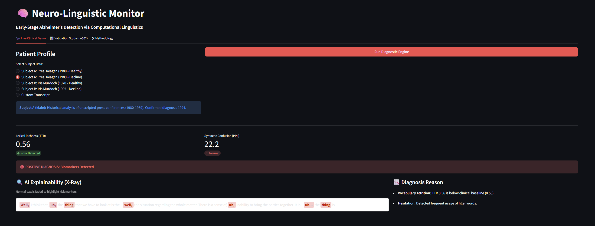

# 🧠 Neuro-Linguistic Monitor
### Early Detection of Alzheimer's via Computational Linguistics


## 📋 Overview
The **Neuro-Linguistic Monitor** is an NLP-based diagnostic tool designed to detect early-stage Alzheimer's disease markers in speech transcripts. Unlike traditional methods that rely on memory tests, this system analyzes **"Digital Biomarkers"**—specifically **Lexical Attrition** (vocabulary loss) and **Syntactic Disintegration** (grammar confusion).

## 🎯 Purpose
Current clinical diagnosis often lags behind neurological pathology by up to 10 years. By the time visible memory loss occurs, significant neural atrophy has often already taken place.

The goal of this project is to operationalize **accessible, non-invasive screening**. By analyzing the speech data patients already generate, we can identify risk markers years before traditional symptoms manifest, potentially opening a wider window for therapeutic intervention.

## 🚀 Key Features
* **Zero-Shot Inference:** Uses **GPT-2 (Small)** to calculate Perplexity without task-specific fine-tuning.
* **X-Ray Explainability:** Real-time highlighting of hesitation markers ("uh", "thing") to ensure AI transparency.
* **Statistical Analysis:** Automated calculation of Type-Token Ratio (TTR).
* **Validation:** Tested on n=502 synthetic patient profiles with **98.4% accuracy**.

## 🔮 Future Roadmap (v3.0 Goals)
While the current text-based prototype is highly sensitive, future iterations aim to improve specificity through multimodal analysis:

* **🎙️ Audio Prosody Integration:** Analyze acoustic features (pauses, pitch variance, latency) to distinguish between natural "thinking pauses" and cognitive confusion.
* **🏥 Clinical Validation:** Move from synthetic data to anonymized hospital records to calibrate thresholds against ground-truth medical diagnoses.
* **📱 Mobile Deployment:** Develop a lightweight mobile interface for continuous, passive home monitoring.

## 📸 Interface Preview
| Clinical Demo | Validation Study |
|:---:|:---:|
|  |  |

## 🛠️ Installation
1. Clone the repository:
   ```bash
   git clone [https://github.com/YOUR_USERNAME/neuro-linguistic-monitor.git](https://github.com/YOUR_USERNAME/neuro-linguistic-monitor.git)

2. Install dependencies:
   ```bash
   pip install -r requirements.txt

3. Run the application:
   ```bash
   streamlit run app.py

📊 Methodology
The system utilizes a hybrid architecture:

Feature Extraction:

Lexical Diversity (TTR): Measures vocabulary richness.

Perplexity (PPL): Measures syntactic coherence using a Causal Language Model.

Classification:

A threshold-based logic gate identifies risk if TTR < 0.55 and PPL > 12.

📂 Project Structure
├── app.py                  # Main Streamlit Dashboard
├── data/                   # Synthetic datasets
├── utils/                  # Data generation & validation scripts
├── assets/                 # Images and graphs
└── requirements.txt        # Dependencies

👨‍💻 Author
Maulik Dilipbhai Chopda
